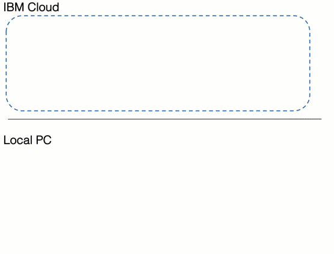
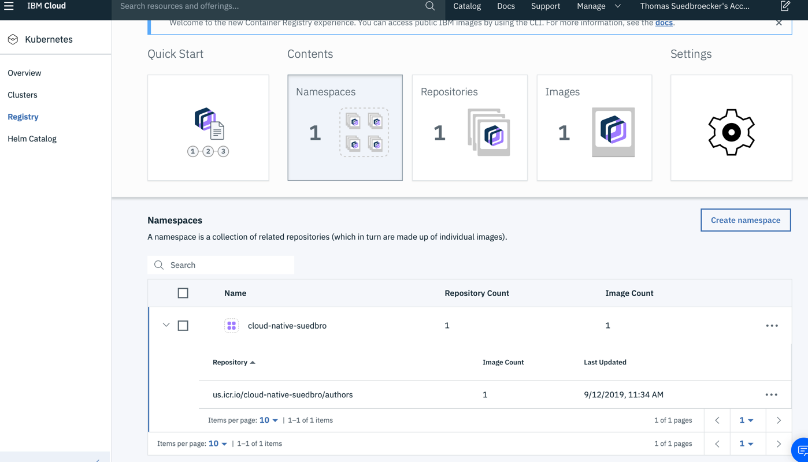
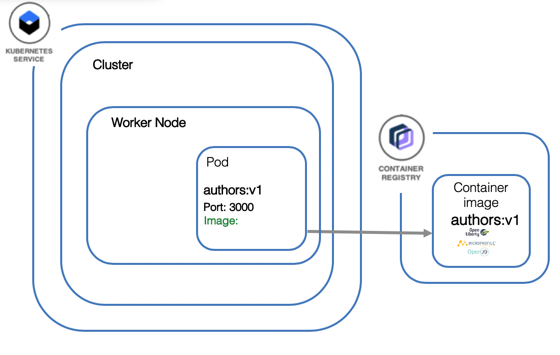
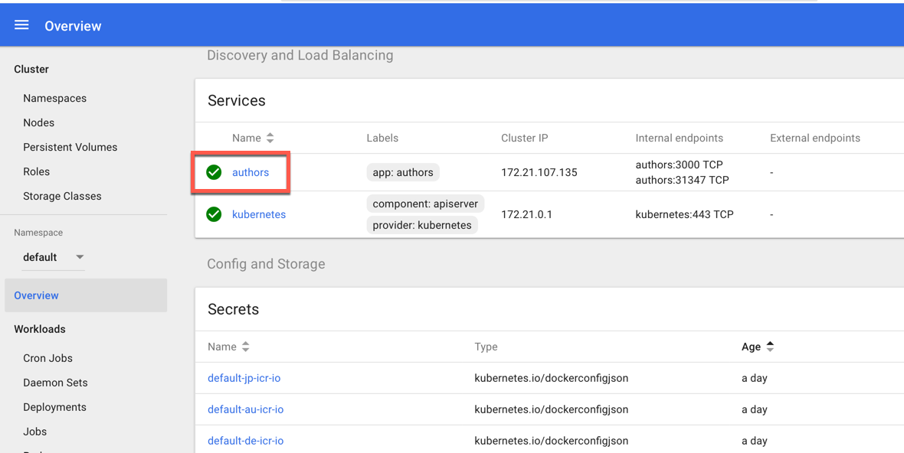

# Lab 4 - Deploying to Kubernetes

In this lab we will work in the Kubernetes Web Console and with the Kubernetes CLI. 

> ["Kubernetes (K8s) is an open-source system for automating deployment, scaling, and management of containerized applications."](https://kubernetes.io)

The following image is a simplified overview of the topics of that lab.


This lab has two parts: 

1. Start build and save the container image

2. Deploy the application and expose the service
    * We will define and apply a deployment configuration (yaml) to create a Pod with our microservice
    * We will define a service which routes requests to the Pod with our microservice

The following gif is an animation of the simplified steps above in a sequence.



---

Remember which option you have choosen, when you did the setup of the prereqs. 

* [Tools - Option 1 (prefered for Mac or Linux)](./1-prereqs.md#tools---option-1-prebuilt-image-with-local-code)


Step |  |
--- | --- 
1 | You started the Docker image in the interactive mode, with a mapping to the downloaded Cloud Native Starter project on your local computer. That terminal session should be open.
2 |  Ensure you access the Docker container in a interactive terminal session and then navigate to the folder `cloud-native-starter/authors-java-jee`.
3 | [Move on with the lab](./4-kubernetes.md#step-1-build-and-save-the-container-image-in-the-ibm-cloud-container-registry).


* [Tools - Option 2 (prefered for Windows)](./1-prereqs.md#tools---option-2-prebuilt-image-with-code-in-container)

Step |  |
--- | --- 
1 | You started the Docker image in the interactive mode and you downloaded the Cloud Native Starter project in the running Docker container.  That terminal session should be open.
2 |  Ensure you have open Docker image in a interactive terminal session and navigate to the folder `cloud-native-starter/authors-java-jee` **REMINDER:** The code changes from lab 3 you did on your local computer, don't exist in the running Docker container.
3 | [Move on with the lab](4-kubernetes.md#step-1-build-and-save-the-container-image-in-the-ibm-cloud-container-registry).

---

# 1. Build and save the container image

## Step 1: Build and save the container image in the IBM Cloud Container Registry

Now we want to build and save a container image in the IBM Cloud Container Registry. 

1. Ensure you logon on to IBM Cloud.
   
   >REMEMBER: You should know this from the prerequisites. 
   
   You can follow the steps in the **Access** tab, by starting from **After your cluster provision ..** and inserting the commands into your terminal session.

    

2. Logon to the IBM Cloud Container Registry (Ensure you are in the $ROOT_FOLDER/authors-java-jee)

    ```sh
    $ cd $ROOT_FOLDER/authors-java-jee
    $ ibmcloud cr login
    ```

2. List you namespaces inside the IBM Cloud Container Registry 

    ```sh
    $ ibmcloud cr namespaces
    ```

    _Sample result output:_

    ```sh
    $ Listing namespaces for account 'Thomas Suedbroecker's Account' in registry 'us.icr.io'...
    $
    $ Namespace   
    $ cloud-native-suedbro   
    ```

3. Now upload the code and build the container image inside IBM Cloud Container Registry. We use the information from step 3, where we got the list of namespaces.

    ```sh
    $ ibmcloud cr build -f Dockerfile --tag $REGISTRY/$REGISTRY_NAMESPACE/authors:1 .
    ```

    _Sample result values:_

    ```sh
    $ ibmcloud cr build -f Dockerfile --tag us.icr.io/cloud-native-suedbro/authors:1 .
    ```

    _Optional:_ Verify the container upload in the IBM Cloud web UI.

    

4. List the container images to verify the upload.

    ```sh
    $ ibmcloud cr images
    ```

    _Sample result output:_

    ```sh
    $ Listing images...
    $
    $ Repository                               Tag   Digest         Namespace              Created         Size     Security status   
    $ us.icr.io/cloud-native-suedbro/authors   1     5a86758f1056   cloud-native-suedbro   2 minutes ago   226 MB   3 Issues   
    $
    $ OK
    ```

5. Copy the REPOSITORY path for the uploaded **Authors** container image. In this sample case it would be: ```us.icr.io/cloud-native-suedbro/authors``` and save it somewhere, we need this later in the deployment.yaml configuration.

---

# 2. Apply the Deployment

This deployment will deploy a container to a Pod in Kubernetes.
For more details we use the [Kubernetes documentation](https://kubernetes.io/docs/concepts/workloads/pods/pod-overview/) for Pods.

> A Pod is the basic building block of Kubernetes–the smallest and simplest unit in the Kubernetes object model that you create or deploy. A Pod represents processes running on your Cluster .

Here is a simplified image for that topic. The deployment.yaml file points to the container image that needs to be instantiated in the pod.



Let's start with the deployment yaml. For more details see the [Kubernetes documentation](https://kubernetes.io/docs/concepts/workloads/controllers/deployment/) for deployments.

Definition of `kind` defines this as a `Deployment` configuration.

  ```yml
  kind: Deployment
  apiVersion: apps/v1
  metadata:
    name: authors
  ```

In the `spec` section we specify an app name and version label.

  ```yml
  spec:
    ...
    template:
      metadata:
        labels:
          app: authors
          version: v1
  ```

Then we define a `name` for the container and we provide the container `image` location, e.g. where the container can be found in the **Container Registry**. 

The `containerPort` depends on the port definition inside our Dockerfile and in our server.xml.

We have previously talked about the usage of the HealthEndpoint class for our Authors service and here we see it the `livenessProbe` definition.


  ```yml
  spec:
        containers:
        - name: authors
          image: authors:1
          ports:
          - containerPort: 3000
          livenessProbe:
  ```

This is the full [deployment.yaml](../authors-java-jee/deployment/deployment.yaml) file.

  ```yaml
  kind: Deployment
  apiVersion: apps/v1
  metadata:
    name: authors
  spec:
    selector:
    matchLabels:
      app: authors
      version: v1
    replicas: 1
    template:
      metadata:
        labels:
          app: authors
          version: v1
      spec:
        containers:
        - name: authors
          image: us.icr.io/cloud-native-suedbro/authors:1
          ports:
          - containerPort: 3000
          livenessProbe:
            exec:
              command: ["sh", "-c", "curl -s http://localhost:3000/"]
            initialDelaySeconds: 20
          readinessProbe:
            exec:
              command: ["sh", "-c", "curl -s http://localhost:3000/health | grep -q authors"]
            initialDelaySeconds: 40
        restartPolicy: Always
  ```

#### Step 1: Apply the deployment

1. Ensure you are in the ```$ROOT_FOLDER/authors-java-jee/deployment```

  ```
  $ cd $ROOT_FOLDER/authors-java-jee/deployment
  ```

2. Open the ```../authors-java-jee/deployment/deployment.yaml``` file with a editor and replace the value for the container image location with the path we got from the IBM Container Registry and just replace the ```authors:1``` text, and add following statement ```imagePullPolicy: Always``` and **save** the file.

_Note:_ With the specification ```imagePullPolicy: Always``` we force that the image is pulled from the IBM Cloud Container Registry and not cashed image in Kubernetes is possible used, when we change our container image IBM Cloud Container Registry.

_REMEMBER:_ You should have saved the IBM Container Registry information somewhere.

  Before:

  ```yml
    image: authors:1
  ```

  Sample change:

  ```yml
    image: us.icr.io/cloud-native-suedbro/authors:1
    imagePullPolicy: Always
    ports:
        - containerPort: 3000
  ```

3. Now we apply the deployment and we create a new **Authors** Pod.

    ```sh
    $ kubectl apply -f deployment.yaml
    ```

    _Note:_ 
    1. If you get the following **error**. Please change the entry `apps/v1beta1` to `apps/v1` in the `deployment.yaml` file. ([The `apps/v1` is the newer deployment definition](https://kubernetes.io/docs/concepts/workloads/controllers/deployment/#creating-a-deployment))
       ```sh
       error: unable to recognize "deployment.yaml": no matches for kind "Deployment" in version "apps/v1beta1"
       ```
    2. If you get the following **error**:

       ```sh
       error: error validating "deployment.yaml": error validating data: ValidationError(Deployment.spec): missing required field "selector" in io.k8s.api.apps.v1.DeploymentSpec; if you choose to ignore these errors, turn validation off with --validate=false
       ```
       You need to insert in the `deploment.yaml`file the statement `selector:matchLabels:name:authors` as you see in the following `deployment.yaml` extract. ([The `selector` is now required](https://kubernetes.io/docs/concepts/workloads/controllers/deployment/#creating-a-deployment))
       
       ```yaml
           ...
           spec:
             replicas: 1
             selector:
               matchLabels:
                 app: authors
                 version: v1
           ...
        ```

#### Step 2: Verify the deployment with kubectl

1. Insert this command and verify the output.

    ```sh
    $ kubectl get pods
    ```

    Sample output:

    ```sh
    $ NAME                      READY   STATUS    RESTARTS   AGE
    $ authors-7b6dd98db-wl9wc   1/1     Running   0          6m9s
    ```

#### Step 3: Verify the deployment with the **Kubernetes dashboard** 

1. Open your Kubernetes Cluster in the IBM Cloud web console

2. Open the Kubernetes dashbord
   
   

3. In the overview you see the created deployment and the pod

  


# 3. Apply the service

After the definition of the Pod we need to define how to access the Pod. For this we use a service in Kubernetes. For more details see the [Kubernetes documentation](https://kubernetes.io/docs/concepts/services-networking/service/) for service.

> A Kubernetes Service is an abstraction which defines a logical set of Pods and a policy by which to access them - sometimes called a micro-service. The set of Pods targeted by a Service is (usually) determined by a Label Selector.

In the service we map the NodePort of the cluster to the port 3000 of the Authors microservice running in the authors Pod, as we can see in the following picture.


In the [service.yaml](../authors-java-jee/deployment/service-os.yaml) we see a selector of the pod using the label 'app: authors'. 

```yaml
kind: Service
apiVersion: v1
metadata:
  name: authors
  labels:
    app: authors
spec:
  selector:
    app: authors
  ports:
    - port: 3000
      name: http
  type: NodePort
---
```

---

#### Step 1: Ensure you are in the `$ROOT_FOLDER/authors-java-jee/deployment`

  ```sh
  $ cd $ROOT_FOLDER/authors-java-jee/deployment
  ```

#### Step 2: Apply the service specification

  ```sh
  $ kubectl apply -f service.yaml
  ```

#### Step 3: Verify the service in Kubernetes with kubectl

  ```sh
  $ kubectl get services
  ```

  Sample output:

  ```sh
    $ NAME         TYPE        CLUSTER-IP       EXTERNAL-IP   PORT(S)          AGE
    $ authors      NodePort    172.21.107.135   <none>        3000:31347/TCP   22s
    $ kubernetes   ClusterIP   172.21.0.1       <none>        443/TCP          28h
  ```

#### Step 4: Verify the service in the **Kubernetes dashboard** 

1. Open your Kubernetes Cluster in the IBM Cloud web console

2. Open the Kubernetes dashbord
   

3. In the overview scroll down until you see the created service
   


#### Step 5: Verify the running microservice on Kubernetes 

1. Get cluster (worker node) [IP address](https://cloud.ibm.com/docs/containers?topic=containers-nodeport) 

    ```sh
    $ clusterip=$(ibmcloud ks workers --cluster cloud-native | awk '/Ready/ {print $2;exit;}')
    $ echo $clusterip
    $ 184.172.247.228
    ```

   > Expose a public port on your worker node and use the public IP address of the worker node to access your service in the cluster publicly from the internet.

2. Get nodeport to access the service (do you remember the mapping?)

    ```sh
    $ nodeport=$(kubectl get svc authors --ignore-not-found --output 'jsonpath={.spec.ports[*].nodePort}')
    $ echo $nodeport
    $ 31347
    ```

3. Open API explorer.

    ```sh
    $ echo http://${clusterip}:${nodeport}/openapi/ui/
    ```

    Sample output:
    ```sh
    $ http://184.172.247.228:31347/openapi/ui/
    ```

    Copy and past the URL in a local browser on your PC:

    


4. Execute curl to test the **Authors** service.

    ```sh
    $ curl http://${clusterip}:${nodeport}/api/v1/getauthor?name=Niklas%20Heidloff
    ```

    Sample result:
    ```
    $ {"name":"Niklas Heidloff","twitter":"@nheidloff","blog":"http://heidloff.net"}
    ```

5. Execute following curl command to test the **HealthCheck** implementation for the **Authors** service.

    ```sh
    $ curl http://${clusterip}:${nodeport}/health
    $ {"checks":[{"data":{"authors":"ok"},"name":"authors","state":"UP"}],"outcome":"UP"} 
    ```

    Optional: 
    1. We can also verify that call in the browser.

       

    2. We can simply delete the deployed Authors microservice with:
        ```sh
        $ kubectl delete pods,services -l app=authors
        ```
---

:star: **Congratulations** :thumbsup: you have finished this **hands-on workshop** :checkered_flag:.


