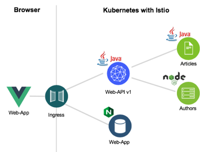
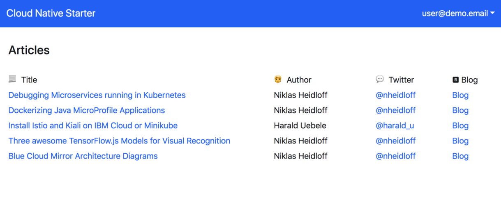

# Introduction

As part of this workshop, we will see how to develop cloud-native microservices using Jakarta EE and MicroProfile, which are deployed using Docker CLI, Kubernetes, and Istio.
We'll examine the basics of modern cloud native Java micro-services development with container, rest APIS, traffic management, and resiliency.

## The "Cloud Native Starter" application

With "Cloud Native Starter" application you can **show**, **add** and **remove** articles with authors information.

The application is built on microservices with one frontend web application.

* **Web-App** Is hosted on a Nginx server that provides a Vue **Web-App** to the browser
* **Web-API** is accessed by the Vue app and provides a list of blog articles and their authors
* **Articles** holds the list of blog articles
* **Authors** holds the blog authors details (blog URL and Twitter handle)

### **Microservices and Web-App**

These are the responibilities of the different microservices and the web-app.

**Web-App**

The is the UI for the user and only displays the given entries.

**Articles microservice**

The objective of this microservice is to **add** and **get** article information from a database. 
In this workshop we will use the default implementation which just creates sample data values.

The mircoservice is organized in following packages:

* apis
* business
* data

**Web-api microservice**

The objective of this microservice is to combine information from different services and provide that information to be consumned using a REST API in the vue webapp. In this case the information of **articals** and **authors** are combined to be consunmed by the webapp.

This microservice also organized in following packages:

* apis
* business
* data

**Authors microservice**

# Technologies

## Technology of the microservices

The **'articles'** and **'web-api'** micro-service are based purly only on open source components:

* [OpenJ9 0.12.1](https://projects.eclipse.org/projects/technology.openj9/releases/0.12.1/review)
* OpenJDK 8u202-b08 from AdoptOpenJDK
* [Open Liberty 18.0.0.4](https://openliberty.io/downloads/)
* [MicroProfile 2.1](https://projects.eclipse.org/projects/technology.microprofile/releases/microprofile-2.1)

To ensure that distributed tracing it supported [zipkintracer](https://github.com/openzipkin/zipkin-ruby) is copied onto the image.

## MicroProfile

For cloud-native applications Kubernetes and Istio deliver a lot of important functionality out of the box, for example to ensure **resiliency** and **scalability**. This functionality works generically for microservices, no matter in which language they have been implemented and independent from the application logic.

Some cloud-native functionality however cannot be handled by Kubernetes and Istio, since it needs to be handled in the business logic of the microservices, for example application specific failover functionality, metrics and fine-grained authorization.

That’s why we use Eclipse MicroProfile, which is an extension to JavaEE to build microservices-based architectures and a great programming model for Istio. In addition to the application specific logic that Istio cannot handle, it also comes with convenience functionality that you typically need when developing microservices, for example invoking REST APIs and implementing REST APIs including their documentation.

[source](http://heidloff.net/article/dockerizing-container-java-microprofile)

## Getting started

To get started, clone the Git repository and use the projects that are provided inside:

