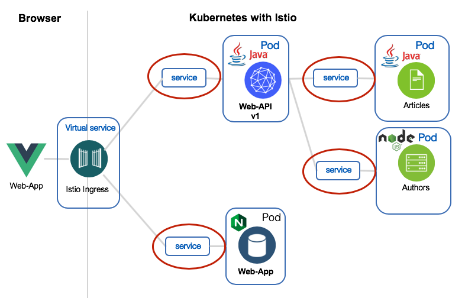

## Building and deploying Containers
****** **UNDER CONSTRUCTION** ******

In this Lab we build and deploy the containers with microservices to Kubernetes.

Along this way we inspect the **Dockerfiles** for the container images and we take a look into the configured **yaml files** to create the **deployment** for the microservices.

The following diagram shows a high level overview of steps which will be automated later with bash scripts.


1. Uploading container definition
2. Building and storing of theproduction container image inside the IBM Cloud Registry
3. Deploying the containers into the Kuberentes Cluster

## 1 Container images

Before we will execute the bash scripts to build and upload the container images, we will take a look into the Dockerfiles to build these container images.

### 1.1 Java container images

The **articles** and the **authors** microservices are written in Java and they run on **OpenLiberty**.

#### 1.1.1 Articles container image definition

Let's take a look into the [Dockerfile](../articles-java-jee/Dockerfile.nojava) to create the articles service. Inside the Dockerfile we use **multiple stages** to build the container image. 
The reason for the two stages is, we have the objective to be **independed** of local environment settings, when we build the application for the container.

With this concept we don't have to ensure that **Java** and **Maven** (or wrong versions) is installed on the local machine of the developers.

One Container is only responsible to build the application let us call this container **Build environment container** and the other container we will call the **production** contrainer.

* Build environment container

Here we create our **build environment container** based on the maven 3.5 image from the [dockerhub](https://hub.docker.com/_/maven/).

```Dockerfile
FROM maven:3.5-jdk-8 as BUILD
COPY src /usr/src/app/src
COPY pom.xml /usr/src/app
```

Let's build the **articles.war** inside the container image, using the maven command **mvn -f pom.xml clean package** .

```Dockerfile
RUN mvn -f /usr/src/app/pom.xml clean package
```

* Production container

Here we create the **production container** based on the **openliberty** with **microProfile2**.
Then **zipkintracer** will be installed.

```Dockerfile
FROM openliberty/open-liberty:microProfile2-java8-openj9
ADD liberty-opentracing-zipkintracer-1.2-sample.zip /
RUN unzip liberty-opentracing-zipkintracer-1.2-sample.zip -d /opt/ol/wlp/usr/ \
 && rm liberty-opentracing-zipkintracer-1.2-sample.zip
COPY liberty/server.xml /config/
```

Now it is time to copy the build result **articles.war** form our **build environment container** into the correct place inside the **production container**.

```Dockerfile
COPY --from=BUILD /usr/src/app/target/articles.war /config/dropins/
```
#### 1.1.2 Web-api-V1 container image definition

The web-api [Dockerfile](../web-apo-java-jee/Dockerfile.nojava) to create the web-api service, works in the same way as for **articles container**. Inside the Dockerfile we use the same multiple stages to build the container image as in the for the **articles container**. 

### 1.2. Node.JS container images

The **web-app** and the **authors** services are written in Node.JS.

#### 1.2.1 Web-app container image definition

The web-app [Dockerfile](../web-app-vuejs/Dockerfile) to create the  web-app application, works in the same way as for **articles container**. Inside the Dockerfile we use the same multiple stages to build the container image as in the for the **articles container**.

Here is **build environment container** based on the alpine 8 image from the [dockerhub](https://hub.docker.com/_/alpine).

```Dockerfile
FROM node:8-alpine as BUILD
 
COPY src /usr/src/app/src
COPY public /usr/src/app/public
COPY package.json /usr/src/app/
COPY babel.config.js /usr/src/app/

WORKDIR /usr/src/app/
RUN yarn install
RUN yarn build
```

The **production container** is based on [nginx](https://hub.docker.com/_/nginx).

```Dockerfile
FROM nginx:latest
COPY nginx.conf /etc/nginx/conf.d/default.conf
COPY --from=BUILD /usr/src/app/dist /usr/share/nginx/html
```
#### 1.2.2 Authors container image definition

The authors [Dockerfile](../authors/Dockerfile) to create the web-api service, does directly create the production image and is based on the alpine 8 image from the [dockerhub](https://hub.docker.com/_/alpine).

```Dockerfile
FROM node:8-alpine

# Create app directory
WORKDIR /usr/src/app

# Install app dependencies
COPY package*.json ./
RUN npm install

# Bundle app source
COPY . .

# Server listens on
EXPOSE 3000

CMD ["npm", "start"]
```

## 1.3 Configurations for the deployment to Kubernetes

Now we examine the deployment yamls to deploy the container to Pods and creating Service to access them in the Kubernetes Cluster.

### 1.3.1 Web-app

* Service and Deployment configuration for the micro service

With [kind: Service](https://kubernetes.io/docs/concepts/services-networking/service/) we define the access to your microservice inside Kubernetes and the [kind: Deployment](https://kubernetes.io/docs/concepts/workloads/controllers/deployment/) defines how we expose the  microservice on a Pod in Kubernetes and even more configuration options you can find on the [Kubernetes documentation](https://kubernetes.io/docs/concepts/workloads/controllers/deployment/).

```yaml
kind: Service
apiVersion: v1
metadata:
  name: web-app
  labels:
    app: web-app
spec:
  selector:
    app: web-app
  ports:
    - port: 80
      name: http
  type: NodePort
---

kind: Deployment
apiVersion: apps/v1beta1
metadata:
  name: web-app
spec:
  replicas: 1
  template:
    metadata:
      labels:
        app: web-app
        version: v1
    spec:
      containers:
      - name: web-app
        image: web-app:1
        ports:
        - containerPort: 80
      restartPolicy: Always
---

```

### 1.3.2 Web-api-V1

```yaml
kind: Deployment
apiVersion: apps/v1beta1
metadata:
  name: web-api-v1
spec:
  replicas: 1
  template:
    metadata:
      labels:
        app: web-api
        version: v1
    spec:
      containers:
      - name: web-api
        image: web-api:1
        ports:
        - containerPort: 9080
        livenessProbe:
          exec:
            command: ["sh", "-c", "curl -s http://localhost:9080/"]
          initialDelaySeconds: 20
        readinessProbe:
          exec:
            command: ["sh", "-c", "curl -s http://localhost:9080/health | grep -q web-api"]
          initialDelaySeconds: 40
      restartPolicy: Always
---
```

## 1.4 Ingress configuration

With the configuation of the **kind: VirtualService** for [Ingress gateway](https://kubernetes.io/docs/concepts/services-networking/ingress/) we define the routing access from the internet over the service to the microservices **web-api** and **web-app**.

With **kind: Service** and  **kind: Deployment** we defined the Pods and the Services inside Kubernetes.

Now the **kind: VirtualService** with the machting will be defined.




```yaml
apiVersion: networking.istio.io/v1alpha3
kind: VirtualService
metadata:
  name: virtualservice-ingress-web-api-web-app
spec:
  hosts:
  - "*"
  gateways:
  - default-gateway-ingress-http
  http:
  - match:
    - uri:
        prefix: /web-api/v1/getmultiple 
    route:
      - destination:
          host: web-api
          subset: v1
...
  - match:
    - uri:
        prefix: /openapi/ui/ 
    route:
    - destination:
        port:
          number: 9080
        host: web-api
  - match:
    - uri:
        prefix: /openapi
    route:
    - destination:
        port:
          number: 9080
        host: web-api
...
  - match:
    - uri:
        prefix: /
    route:
    - destination:
        port:
          number: 80
        host: web-app
---
```

## 1.5 Deploy the containers to the Kubernetes Cluster

Invoke following bashscripts to deploy the microservices:

```
$ ./iks-scripts/deploy-articles-java-jee.sh
$ ./iks-scripts/deploy-authors-nodejs.sh
$ ./iks-scripts/deploy-web-api-java-jee.sh
$ ./iks-scripts/deploy-web-app-vuejs.sh
```

Invoke the curl command which is displayed as output of 'scripts/show-urls.sh' to the the urls of services.

```
$ ./iks-scripts/show-urls.sh
```


